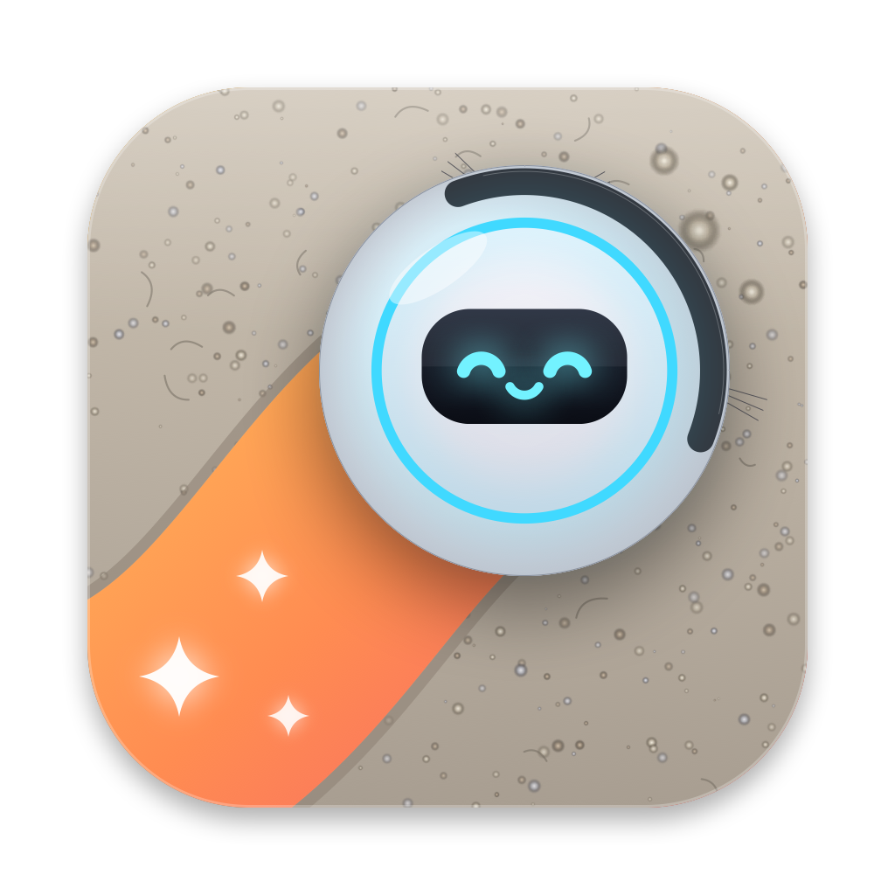
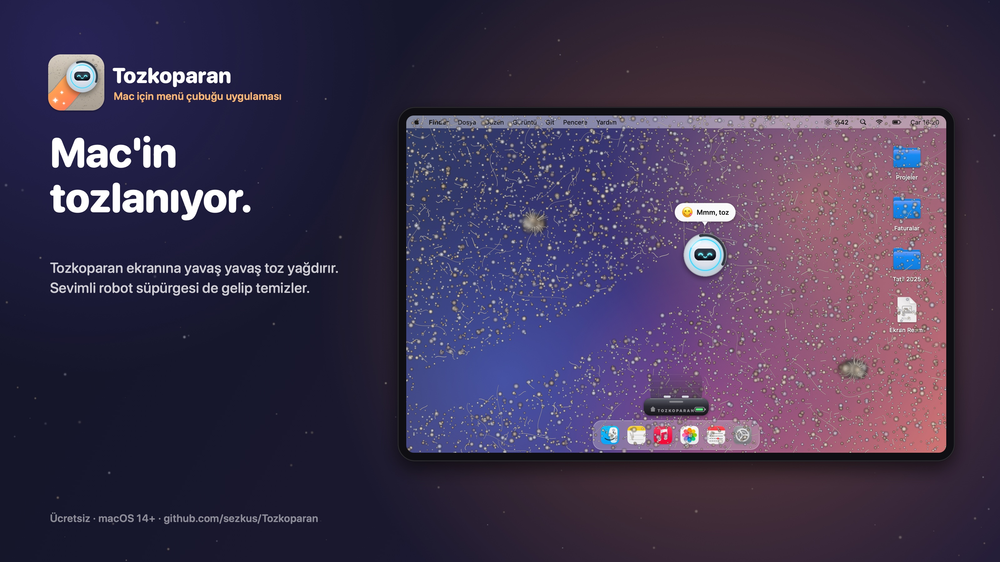
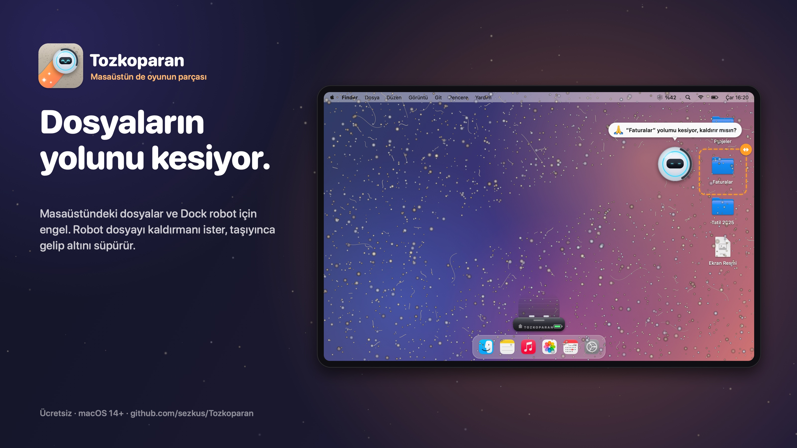
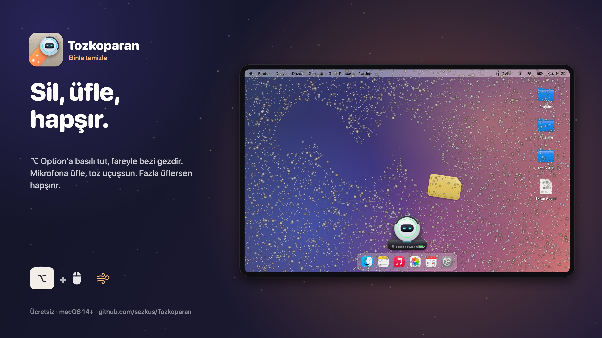
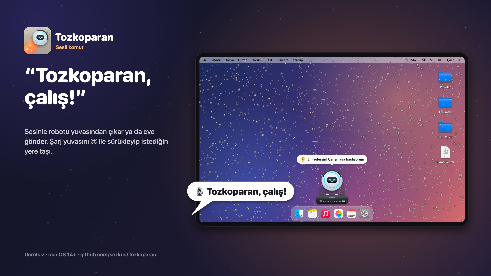
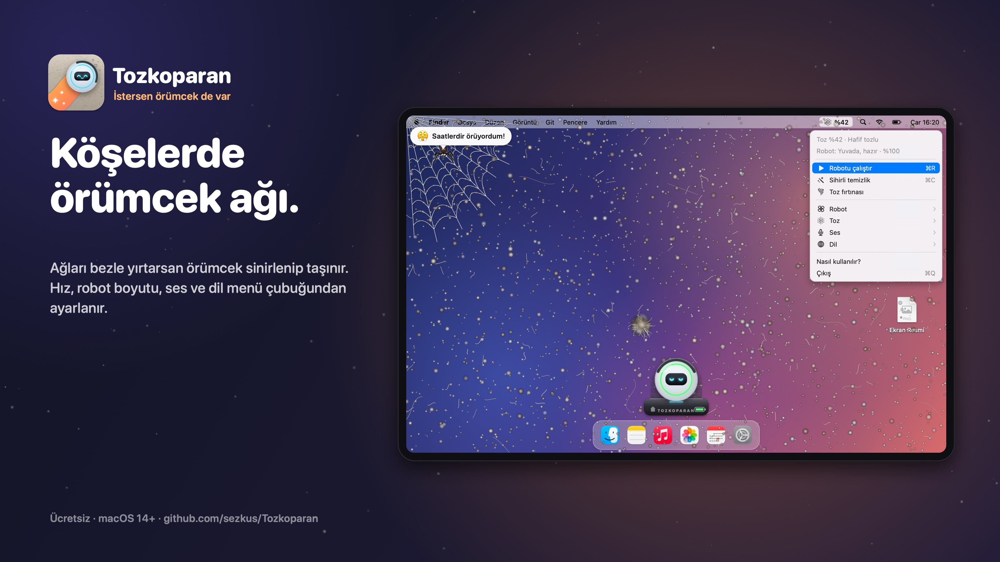
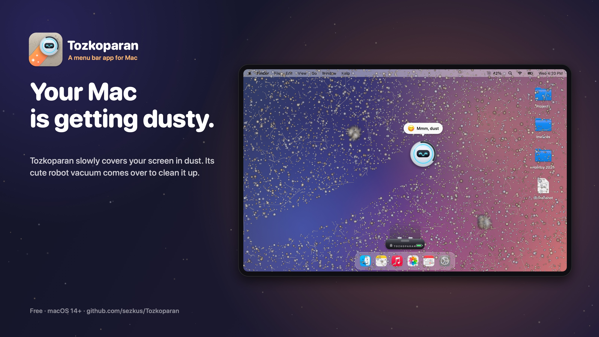

# Tozkoparan 🧹

Mac'in tozlanıyor. Tozkoparan, ekranına yavaş yavaş toz yağdıran ve onu temizlemen için sana bir robot süpürge veren küçük, şakacı bir menü çubuğu uygulaması.

**[⬇︎ Tozkoparan'ı indir (macOS 14+, Apple Silicon ve Intel)](https://github.com/sezkus/Tozkoparan/releases/latest/download/Tozkoparan-0.1.2.zip)**

## Neler yapıyor?

- **Toz birikir.** Ekranın tozlanır, toz canavarları yuvarlanmaya başlar. İstersen köşelere örümcek ağları da örülür.
- **Silebilirsin.** ⌥ Option'a basılı tutup fareyi gezdirince toz bezi çıkar.
- **Üfleyebilirsin.** Mikrofona üflersen toz uçuşur. Fazla üflersen hapşırır.
- **Robot süpürge.** Şarj yuvasından çıkar, tozu emer, pili bitince eve döner. Konuşur, sıkışır, duvara çarpınca söylenir.
- **Masaüstü dosyaların engeldir.** Robot bir dosyanın altını süpüremeyince kaldırmanı ister. Dosyayı taşıyınca altındaki toz izini gelip süpürür. Alt bar (Dock) da engeldir.
- **Fareyi görür.** İmleç önüne gelirse yön değiştirir.
- **Şarj yuvasını taşıyabilirsin.** ⌘ Command'a basılı tutup yuvayı sürükle.
- **Sesli komut.** “Tozkoparan çalış”, “Tozkoparan eve dön”.
- Türkçe ve İngilizce.

## Kurulum

Zip'i aç, `Tozkoparan.app`'i Uygulamalar klasörüne sürükle ve çalıştır. Uygulama Apple tarafından onaylıdır (notarized), uyarı vermeden açılır ve menü çubuğunda belirir.

İlk açılışta mikrofon (üfleme ve sesli komut), konuşma tanıma ve Finder (masaüstü dosyalarının yerini okumak için) izinleri istenir. Robotun masaüstü dosyalarını engel olarak görmesi için menüden ayrıca “Ekran ve Sistem Sesi Kaydı” izni verilebilir; Tozkoparan ekranı kaydetmez, yalnızca pencerelerin yerini okur. Dosyalarına hiçbir zaman dokunmaz.

## Lisans

Copyright (c) 2026 Sezer Kuşku. Tozkoparan ücretsizdir ve [PolyForm Strict 1.0.0](LICENSE) ile lisanslıdır: kişisel ve ticari olmayan kullanım serbesttir; **değiştirme, yeniden dağıtma ve ticari kullanım yasaktır**. Bu depo yalnızca uygulamanın dağıtımı içindir; kaynak kodu açık değildir.

---

# Tozkoparan 🧹 (English)

Your Mac is getting dusty. Tozkoparan is a small, playful menu bar app that slowly covers your screen in dust and gives you a robot vacuum to clean it up.

**[⬇︎ Download for macOS 14+ (Apple Silicon & Intel)](https://github.com/sezkus/Tozkoparan/releases/latest/download/Tozkoparan-0.1.2.zip)**: notarized by Apple, unzip and run.

- Dust settles, dust bunnies roll around, and optional cobwebs get spun in the corners.
- Hold ⌥ Option and move the mouse to wipe with a cloth. Blow into the mic to blow dust away.
- The robot vacuum leaves its dock, cleans, and goes home when the battery runs low.
- Desktop files and the Dock are obstacles: the robot asks you to move a file, then comes back to sweep the spot.
- It steers around your cursor. Hold ⌘ and drag the dock to move it.
- Voice commands: “Tozkoparan start”, “Tozkoparan go home”.

**License:** Copyright (c) 2026 Sezer Kuşku. Free to use under [PolyForm Strict 1.0.0](LICENSE): personal, noncommercial use only; modification, redistribution and commercial use are not permitted. This repository only distributes the app; the source code is not public.
